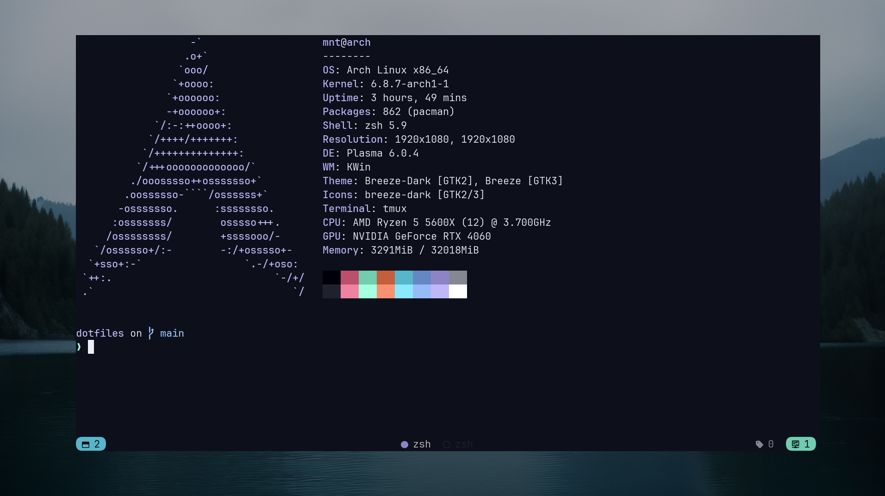

# Dotfiles



## Overview

- [Gooey (Gogh)](https://wezfurlong.org/wezterm/colorschemes/g/index.html#gooey-gogh)
- [WezTerm](https://wezfurlong.org/wezterm/)
- [zsh](https://ohmyz.sh/)
- [neovim](https://www.youtube.com/watch?v=dQw4w9WgXcQ)
- [tmux](https://www.youtube.com/watch?v=dQw4w9WgXcQ)


### Installing
You will need to install `git`

Clone the repo into `$HOME` directory

```bash
git clone https://github.com/0xMNT/dotfiles.git ~/dotfiles
```

Run install script for `arch, btw` distro
```bash
./install.sh
```

### GNU stow
Create symlinks with `stow`

```bash
stow */ # all dirs
```

```bash
stow alacritty # for one config
```
