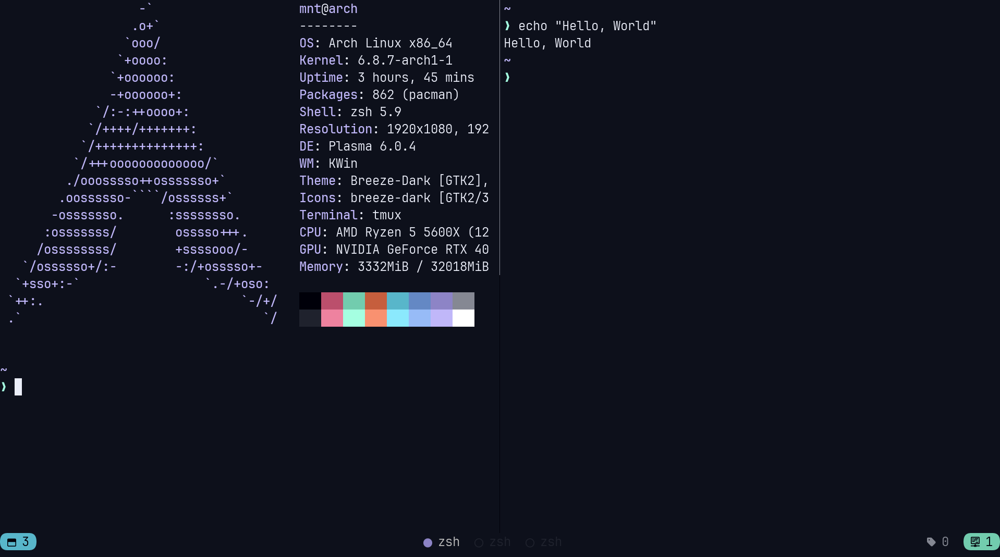

# Dotfiles



## Installing
You will need to install `git`

Clone the repo into `$HOME` directory

```bash
git clone https://github.com/0xMNT/dotfiles.git ~/dotfiles
```

Run install script for arch based distro
```bash
./install.sh
```

### GNU stow
Create symlinks with `stow`

```bash
stow */ # all dirs
```

```bash
stow alacritty # for one config
```
